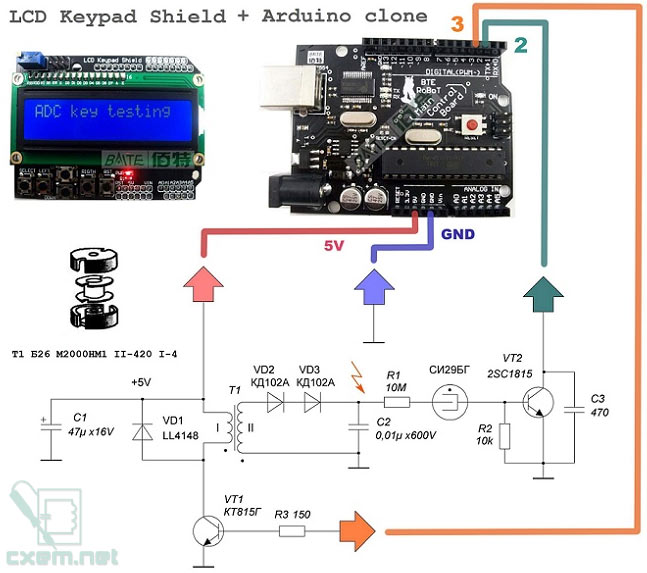

# geiger_uno_shield
geiger counter built on Arduino Uno + display shield.

schematic and original fw by toxcat - https://github.com/project37cat/gca01

described and discussed here - https://cxem.net/dozimetr/3-10.php

remastered and optimized sketch.

added BMP180/GY-65 baro/temp sensor support. connected to 3.3V, GND, A4 (SDA), A5 (SCL).
